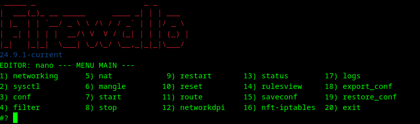

# Firewallo

**Firewallo** is a firewall manager for Debian GNU/Linux that uses either iptables or nftables.
This project was originally created in 2003 for personal use and is not intended for production environments.
Firewallo currently supports IPv4 only — for best practices, it is recommended to disable IPv6 on your system.
Dual-stack (IPv4/IPv6) support is currently under development
The entire core structure has been rewritten to support nftables, following a design similar to the traditional iptables approach (using filter, nat, and mangle tables).
Future development will focus exclusively on nftables.

---

## ✅ Supported OS

- Debian 12

---

## 🛠️ Presets and architecture decisions 
📌 Firewallo currently supports only IPv4 by design. For best practices, it is recommended to disable IPv6 on your system
All chains are defined using the ip family instead of inet.
This decision was made to avoid ambiguous rules: in nftables, if a user writes a generic rule without explicitly specifying ip or ip6, it would apply to both stacks.
Restricting support to IPv4 ensures clear rule behavior and maintains continuity with iptables, which has historically been used in Firewallo and is inherently single-stack (requiring ip6tables for IPv6).
Dual-stack support (inet) may be considered in the future, but for now, IPv4 is the only supported protocol family.

📌All DNS traffic (tcp/udp port 53) is allowed only to the root servers and to the DNS servers explicitly defined in the configuration file.
Any other DNS requests to unspecified servers are blocked by default.

📌The following ports are allowed from LAN to WAN:

    TCP: 20, 21, 22, 23, 25, 80, 110, 143, 443, 995

    UDP: 123

All other traffic between zones is blocked by default.

📌All subnets listed in LANRANGE are automatically subject to NAT masquerading via the interfaces defined in WAN.
In contrast, subnets defined in DMZRANGE are excluded from masquerading by default.

📌restart performs a stop followed by a start operation.
stop flushes all rules but keeps NAT rules active.
reset only flushes the ruleset without reapplying or modifying anything else.

---

## 🎇 Install

Download the latest version from [Releases · un1x80/firewallo · GitHub](https://github.com/un1x80/firewallo/releases).

```bash
wget https://github.com/un1x80/firewallo/releases/download/current/firewallo-24.9.1.10-amd64.deb
apt install ./firewallo-24.9.1.10-amd64.deb -y
```

---

## 🔐 Basic Usage

Execute **Firewallo** from a root shell and select an option from the configuration menu. Here is how the interface looks:

### Main Menu



### Starting Firewall


---

## 🛠️ Build

### Local Build
```bash
git clone -b <main|test> https://github.com/un1x80/firewallo.git
cd firewallo/usr/share/doc/firewallo/ ; ./build.sh local 
```

### GIT Build (Test or Main)
```bash
wget https://raw.githubusercontent.com/un1x80/firewallo/main/usr/share/doc/firewallo/build.sh
chmod +x build.sh ; ./build.sh git <main|test>
```

---

## 💣 Uninstall

```bash
apt autoremove firewallo -y
```
