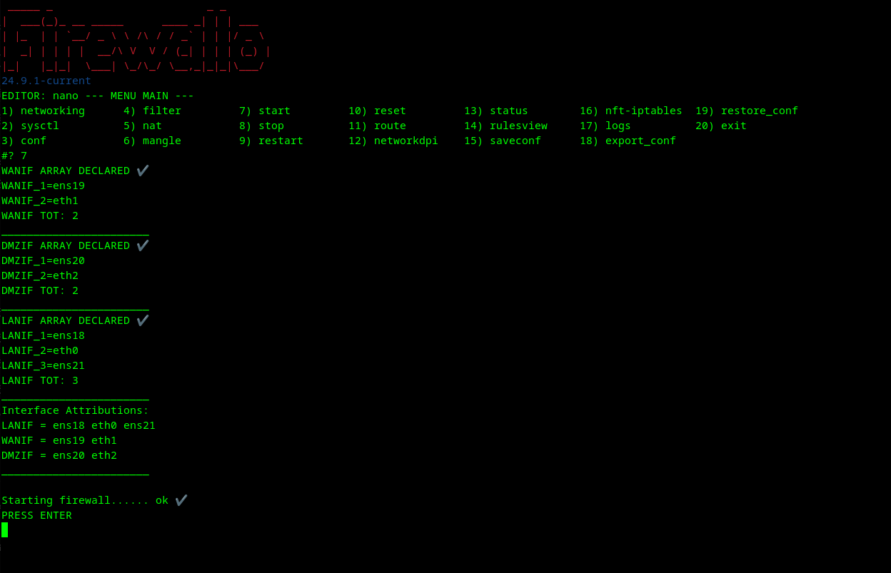

# Firewallo

**Firewallo** is a firewall manager for Debian GNU/Linux that uses iptables or nftables. This project was born in 2003 for personal use. If you think this is interesting for you, write to me, and you'll make me happy.

---

## 📌 Supported OS

- Debian 12

---

## 🎇 Install

Download the latest version from [Releases · un1x80/firewallo · GitHub](https://github.com/un1x80/firewallo/releases).

```bash
wget https://github.com/un1x80/firewallo/releases/download/24.9.1/firewallo-24.9.1-amd64.deb
apt install ./firewallo-24.9.1-amd64.deb -y
```

---

## 🔐 Basic Usage

Execute **Firewallo** from a root shell and select an option from the configuration menu. Here is how the interface looks:

### Main Menu


### Starting Firewall



---

## 🛠️ Build

### Local Build
```bash
git clone -b <main|test> https://github.com/un1x80/firewallo.git
cd firewallo/usr/share/doc/firewallo/ ; ./build.sh local
```

### GIT Build (Test or Main)
```bash
wget -qO- https://raw.githubusercontent.com/un1x80/firewallo/main/usr/share/doc/firewallo/build.sh git <test|main> | bash
```

---

## 💣 Uninstall

```bash
apt autoremove firewallo -y
```

